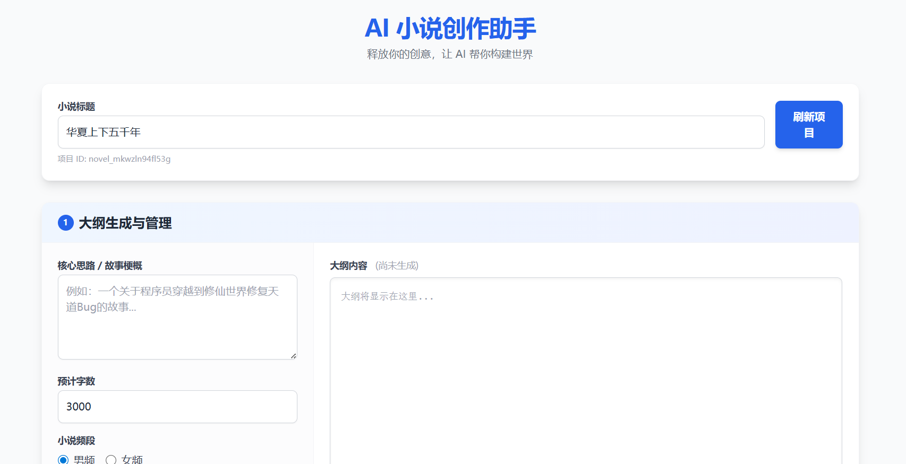

# NovelGenerator - 智能小说创作助手

> 一个基于 HelloAgents 框架的智能小说辅助创作系统，助力创作者从灵感到完稿的全过程。

## 📝 项目简介

**NovelGenerator** 旨在利用大语言模型（LLM）的强大能力，为小说创作者提供智能化的辅助工具。它不仅仅是一个简单的文本生成器，而是一个能够理解故事结构、保持剧情连贯、并具备上下文记忆能力的创作伙伴。

该项目解决了长篇小说创作中的核心痛点：
- **大纲构建困难**：从模糊的灵感到结构化的大纲，AI 帮你梳理逻辑。
- **剧情连贯性**：在生成后续章节时，自动回顾前文情节和摘要，确保人物行为和剧情发展的合理性。
- **创作效率低**：支持批量生成章节，快速推进故事进度。

## ✨ 核心功能

- [x] **智能大纲生成**：根据用户输入的一句话创意、标题及标签，自动生成包含世界观、人物设定、分卷规划的详细大纲。
- [x] **上下文感知章节生成**：基于大纲和前序章节内容，生成连贯的新章节。支持自动回顾前几章摘要和上一章正文。
- [x] **多章连续创作**：支持一次性生成多个章节，AI 会自动维护剧情发展的连续性。
- [x] **同人二创支持**：支持原作设定管理，确保同人创作中角色不OOC（角色崩坏）。
- [x] **内容管理系统**：
    - 自动保存生成的大纲和章节到本地文件（Markdown格式）。
    - 提供web界面通过 API 接口对内容进行读取、更新和删除。
- [x] **创作记忆机制**：自动提取并维护章节摘要和预测信息，作为后续创作的长期记忆。

## 🛠️ 技术栈

- **核心框架**: HelloAgents框架 - 提供 Agent 编排与工具调用能力，使用SimpleAgent。
- **Web 框架**: FastAPI -以此构建高性能的 RESTful API 服务。
- **数据模型**: Pydantic - 用于数据验证和结构定义。
- **文件存储**: 本地文件系统 (Markdown + JSON) - 方便用户直接查看和编辑生成的内容。
- **前端技术**: Vue 3 + Tailwind CSS
- **大语言模型**: 支持兼容 OpenAI 接口的模型（如 DeepSeek, Qwen 等，通过 .env 配置变量）。

## 🚀 快速开始

### 环境要求

- Python 3.10+

### 安装依赖

```bash
pip install -r requirements.txt
```

### 配置环境

1. 在项目根目录创建 `.env` 文件。
2. 配置你的 LLM 模型信息（参考 HelloAgents 文档或根据实际使用的模型填写）：

```
# .env 示例
LLM_PROVIDER=ollama # 或 openai, qwen 等
LLM_MODEL_ID=qwen2.5-72b-instruct
API_KEY=your_api_key
BASE_URL=http://localhost:11434/v1 # 如果使用本地 Ollama
LLM_TIMEOUT=60
HOST=127.0.0.1
PORT=8000
```

### 运行项目

#### 方式一：启动 API 服务（推荐）

启动后端服务，配合前端界面使用。

```bash
python src/app.py
# 或者
uvicorn src.app:app --reload
```

服务启动后，API 文档可访问：`http://127.0.0.1:8000/docs`


#### 方式二：运行测试脚本

如果你想直接在命令行测试生成效果，可以运行 `main.py`：

```bash
python main.py
```

## 📖 使用指南

1. **启动服务**：按照上述步骤启动 FastAPI 服务。
2. **前端交互**：打开 `frontend/index.html`（可以直接在浏览器打开，或通过简单的 HTTP 服务器托管）。
3. **创作流程**：
    - **创建项目**：输入小说标题和 ID。
    - **生成大纲**：输入你的核心创意（如"一个关于AI程序员穿越到代码世界的故事"），点击生成大纲。
    - **生成章节**：大纲生成确认无误后，进入章节生成页面，输入第一章的简要构思（可选），点击生成。
    - **查看与修改**：生成的章节会显示在列表中，你可以点击阅读，并进行手动修改保存。


## 🏗️ 项目架构

### 整体架构

```
NovelGenerator/
├── agents/                 # Agent 核心逻辑层
│   ├── outline_agent.py    # 大纲生成 Agent
│   ├── chapter_generate_agent.py  # 章节生成 Agent（核心）
│   ├── canon_manager.py    # 原作设定管理（同人二创）
│   ├── note_storage.py     # 笔记存储工具类
│   └── prompt.py           # Prompt 模板
├── src/                    # API 服务层
│   ├── app.py              # FastAPI 路由定义
│   ├── bootstrap.py        # 依赖注入容器
│   └── project_manager.py  # 项目数据管理
├── frontend/               # 前端界面
│   └── index.html          # Vue3 + Tailwind 单页应用
├── outputs/                # 输出存储
│   ├── {title}-{novel_id}/ # 小说项目目录
│   │   ├── outline/        # 大纲文件
│   │   ├── chapters/       # 章节文件
│   │   └── project_data.json  # 项目索引
│   └── canon_library/      # 原作设定库
├── main.py                 # 命令行测试入口
└── requirements.txt        # 项目依赖
```

### Agent 架构

项目采用两层级Agent架构：

| Agent | 职责 | 输入 | 输出 |
|-------|------|------|------|
| `OutlineAgent` | 生成小说大纲 | 用户创意、原作设定 | 结构化大纲文档 |
| `ChapterGenerateAgent` | 生成具体章节 | 大纲、前文、记忆、原作设定 | 章节内容(JSON) |

**ChapterGenerateAgent 内部结构**：

```python
class ChapterGenerateAgent:
    # 子Agent分工
    - generate_agent: 负责生成章节内容
    - review_agent: 负责审核内容质量（OOC检测、大纲契合度等）
    
    # 记忆管理
    - memories: 内存中的章节缓存（最近5章）
    - note_storages: 文件存储管理
    
    # 同人支持
    - canon_manager: 原作设定管理器
```

## 🧠 上下文管理机制

### 章节生成的上下文组装

每次生成章节时，系统会动态组装以下上下文：

```python
context = {
    "outline": "完整的小说大纲",
    "prev_chapter": "前一章最后800字",  # 保证即时连贯性
    "prev_summaries": "最近5章摘要",     # 保证长期一致性
    "chapter_history": "本章生成历史",   # 审核不通过时的迭代记录
    "evaluation": "审核反馈",            # 修改建议
    "user_input": "用户输入或上一章预测", # 创作指导
    "canon_world": "原作世界观（同人）",  # 同人设定
    "canon_characters": "原作角色（同人）" # 角色设定
}
```

### 上下文流转流程

```
1. 加载原作设定（如果是同人）
   └── canon_manager.get_canon_prompts()
       ├── get_world_prompt()      # 世界观提示
       ├── get_character_prompt()  # 角色设定提示
       └── get_ooc_checklist()     # OOC检查清单

2. 组装上下文
   ├── get_outline()          # 从文件读取大纲
   ├── get_prev_chapter()     # 从内存获取前一章（最后800字）
   └── get_prev_summaries()   # 从内存获取最近5章摘要

3. 生成 + 审核循环
   ├── generate_agent.run(context) → 生成JSON
   ├── review_agent.run(review_context) → 审核结果
   └── 不通过 → 重新组装上下文（带上evaluation）→ 重试

4. 保存并更新记忆
   ├── 写入 .md 文件（YAML frontmatter + 正文）
   ├── 更新 index.json 索引
   └── 追加到内存 memories[novel_id]
```

## 💾 记忆存储机制

### 双层存储架构

| 层级 | 存储形式 | 用途 | 持久化 |
|------|----------|------|--------|
| **文件存储** | Markdown + JSON | 长期持久化、用户编辑 | 是 |
| **内存缓存** | MemoryItem对象 | 快速访问、上下文构建 | 否 |

### 文件存储结构

每个小说项目独立存储：

```
outputs/{title}-{novel_id}/
├── outline/
│   ├── index.json              # 大纲索引
│   └── note_1.md               # 大纲内容
├── chapters/
│   ├── index.json              # 章节索引
│   ├── note_1.md               # 第一章
│   └── note_2.md               # 第二章
└── project_data.json           # 项目元数据（大纲ID、章节列表）
```

**Markdown文件格式**：

```markdown
---
title: 第一章-长安诡事
note_type: chapter
tags: ["本章摘要..."]
created_at: 2025-01-27T10:00:00
---

章节正文内容...
```

### 内存记忆结构

```python
class MemoryItem(BaseModel):
    node_id: str                    # 笔记ID
    novel_id: str
    title: str                      # 章节标题
    content: str                    # 完整内容
    summary: str                    # 章节摘要（用于上下文）
    timestamp: datetime
    next_chapter_prediction: str    # 对下一章的预测
```

### 记忆检索策略

**滑动窗口机制**：只保留最近 `num_chapter_memories`（默认5）章

```python
def get_memories(self, novel_id: str):
    notes = self.note_storages[novel_id].index["notes"]
    chapter_notes = [n for n in notes if n["note_type"] == "chapter"]
    recent_notes = chapter_notes[-self.num_chapter_memories:]  # 取最后5章
    
    for note in recent_notes:
        # 读取.md文件 → 解析内容 → 添加到内存
        self.memories[novel_id].append(MemoryItem(...))
```

## 🎭 同人二创支持

### 原作设定数据结构

```python
@dataclass
class CharacterProfile:
    name: str                    # 角色名
    personality: str             # 性格特征
    speech_pattern: str          # 说话方式/口头禅（关键！防OOC）
    background: str              # 背景经历
    abilities: List[str]         # 能力/技能
    key_events: List[str]        # 关键事件（不可违背）
    ooc_triggers: List[str]      # 可能导致OOC的触发点

@dataclass
class CanonSetting:
    work_name: str               # 作品名
    world_view: str              # 世界观概述
    world_rules: List[str]       # 世界规则
    timeline: str                # 原作时间线
    key_locations: List[str]     # 关键地点
    characters: Dict[str, CharacterProfile]
    forbidden_zones: List[str]   # 二创禁区（绝对不能碰的设定）
```

### 原作设定使用流程

1. **创建原作设定**：通过 `main.py` 的交互式向导或手动创建JSON文件
2. **存储到 canon_library**：保存到 `outputs/canon_library/{作品名}.json`
3. **生成时注入**：Agent自动加载并注入到提示词中
4. **审核时检查**：Review Agent根据OOC检查清单审核生成内容

### 同人模式提示词注入

```python
# 角色设定提示
【原作角色设定卡】
■ 角色名
  性格: xxx
  说话方式: xxx
  关键事件(不可违背): xxx

# 世界观提示
【原作世界观】
作品: xxx
世界观: xxx
世界规则:
  - xxx
二创禁区(不可触碰): xxx

# OOC检查清单
【OOC检查项】
审核时请检查：
- 性格是否符合
- 说话方式是否一致
- 是否触碰禁区设定
```

## 🎯 项目亮点

- **长文本一致性**：通过智能上下文管理和记忆机制，解决长篇生成中的逻辑崩坏问题。
  - 滑动窗口记忆：只保留最近5章，避免token爆炸
  - 摘要传递：用章节摘要维护长期一致性
  - 前一章片段：保留最后800字保证即时连贯
  
- **质量保证机制**：
  - 审核循环：每章生成后自动审核，不通过重试
  - 同人OOC检测：角色性格、说话方式一致性检查
  - 大纲契合度检查：确保不偏离主线

- **结构化工作流**：还原作家真实创作路径（创意 -> 大纲 -> 章节），而非盲目生成。

- **数据完全掌控**：
  - 纯本地存储：Markdown + JSON，用户完全掌控
  - 可编辑：支持手动修改大纲和章节
  - 可迁移：标准格式，方便导出到其他工具

- **所见即所得**：提供直观的 Web 界面，实时预览生成效果，支持手动干预与调整。

## 📂 目录结构详情

```
NovelGenerator/
├── agents/                 # Agent 核心逻辑
│   ├── outline_agent.py    # 大纲生成 Agent（支持同人设定）
│   ├── chapter_generate_agent.py # 章节生成 Agent（支持OOC检测）
│   ├── canon_manager.py    # 原作设定管理（同人二创核心）
│   ├── note_storage.py     # 笔记存储工具类
│   └── prompt.py           # Prompt 模板
├── src/                    # API 服务代码
│   ├── app.py              # FastAPI 应用入口
│   ├── bootstrap.py        # 依赖注入容器
│   └── project_manager.py  # 项目数据管理
├── frontend/               # 前端界面
│   └── index.html          # Vue3 + Tailwind 单页应用
├── outputs/                # 生成结果存储目录
│   ├── canon_library/      # 原作设定库
│   └── {title}-{novel_id}/ # 小说项目目录
├── main.py                 # 命令行测试脚本
├── requirements.txt        # 项目依赖
└── README.md               # 项目文档
```

## 🔮 未来计划（待定）

- [ ] 增加回退功能（版本控制）。
- [ ] 增加人物与事件、技能等知识图谱功能。
- [ ] 短篇小说生成功能。
- [ ] 引入更多样的小说风格。
- [ ] 优化前端界面体验。

## 🤝 贡献指南

欢迎提交 Issue 和 Pull Request！

## 📄 许可证

MIT License

## 👤 作者

- GitHub: [@lgs-only](https://github.com/lgs-only)
- Email: liangguangshi123@outlook.com

## 🙏 致谢

感谢Datawhale社区和Hello-Agents项目！
